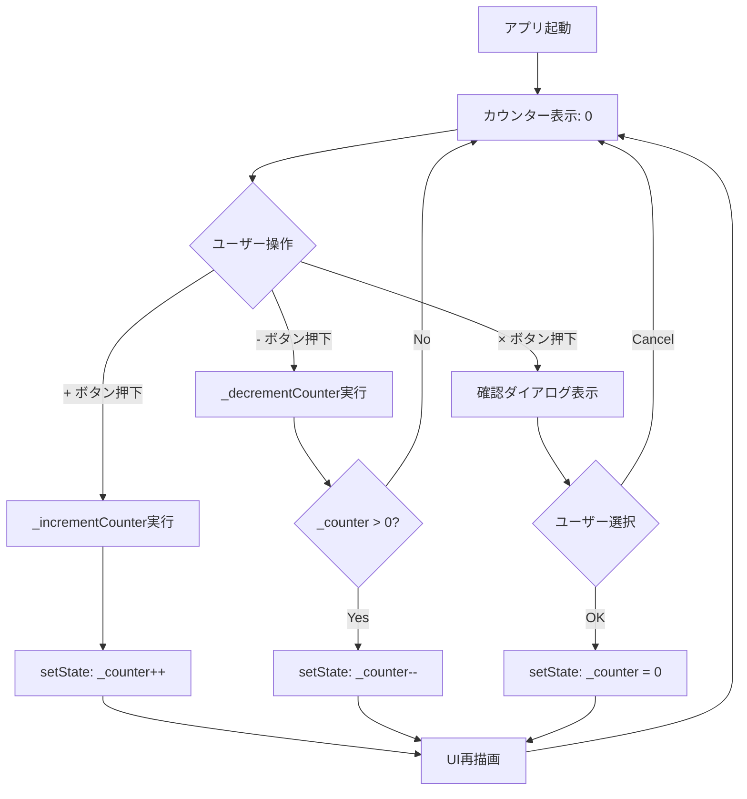

# Flutter カウンターアプリ

Flutterで作成されたクロスプラットフォーム対応のカウンターアプリケーションです。

## 📱 アプリ概要

このアプリは、シンプルなカウンター機能を提供するFlutterアプリケーションです。数値の増加、減少、クリア機能を備えており、Material Designを採用した直感的なUIで操作できます。

## ✨ 主な機能

- **カウンター増加**: `+` ボタンでカウンターを1ずつ増加
- **カウンター減少**: `-` ボタンでカウンターを1ずつ減少（0未満にはならない）
- **カウンタークリア**: `×` ボタンでカウンターを0にリセット（確認ダイアログ付き）
- **日本語対応**: クリア時の確認ダイアログは日本語で表示

## 🔄 処理フロー図



## 🚀 対応プラットフォーム

このアプリは以下のプラットフォームで動作します：

- **モバイル**: iOS、Android
- **デスクトップ**: Windows、macOS、Linux
- **Web**: ブラウザ対応

## 🛠️ 技術仕様

- **Flutter SDK**: ^3.8.0
- **Dart SDK**: ^3.8.0
- **UI フレームワーク**: Material Design
- **状態管理**: StatefulWidget + setState
- **アーキテクチャ**: シンプルなMVCパターン

### 依存関係

```yaml
dependencies:
  flutter:
    sdk: flutter
  cupertino_icons: ^1.0.8

dev_dependencies:
  flutter_test:
    sdk: flutter
  flutter_lints: ^5.0.0
```

## 📦 セットアップ手順

### 前提条件

- Flutter SDK 3.8.0以上がインストールされていること
- 対象プラットフォームの開発環境が整っていること

### インストール

1. リポジトリをクローン
```bash
git clone https://github.com/taimatu7/devin_flutter_todo.git
cd devin_flutter_todo
```

2. 依存関係をインストール
```bash
flutter pub get
```

3. アプリを実行
```bash
# デバッグモード
flutter run

# 特定のプラットフォーム指定
flutter run -d chrome    # Web
flutter run -d windows   # Windows
flutter run -d macos     # macOS
```

## 🏗️ ビルド方法

### リリースビルド

```bash
# Android APK
flutter build apk --release

# iOS (macOS上で実行)
flutter build ios --release

# Web
flutter build web --release

# Windows (Windows上で実行)
flutter build windows --release

# macOS (macOS上で実行)
flutter build macos --release

# Linux (Linux上で実行)
flutter build linux --release
```

## 🧪 開発・テスト

### コード解析
```bash
flutter analyze
```

### テスト実行
```bash
flutter test
```

### ホットリロード
開発中は `flutter run` でアプリを起動し、コード変更時に `r` キーでホットリロードが可能です。

## 📁 プロジェクト構造

```
devin_flutter_todo/
├── lib/
│   └── main.dart          # メインアプリケーションコード
├── android/               # Android固有の設定
├── ios/                   # iOS固有の設定
├── web/                   # Web固有の設定
├── windows/               # Windows固有の設定
├── macos/                 # macOS固有の設定
├── linux/                 # Linux固有の設定
├── pubspec.yaml           # プロジェクト設定・依存関係
└── README.md              # このファイル
```

## 🎯 主要コンポーネント

### MyApp クラス
- アプリケーションのルートウィジェット
- Material Designテーマの設定
- アプリタイトルとホームページの定義

### MyHomePage クラス
- メイン画面のStatefulWidget
- カウンター状態の管理
- 3つのFloatingActionButtonの配置

### 主要メソッド
- `_incrementCounter()`: カウンター増加処理
- `_decrementCounter()`: カウンター減少処理（0未満防止）
- `_clearCounter()`: 確認ダイアログ表示後のクリア処理

## 🤝 コントリビューション

1. このリポジトリをフォーク
2. 機能ブランチを作成 (`git checkout -b feature/amazing-feature`)
3. 変更をコミット (`git commit -m 'Add some amazing feature'`)
4. ブランチにプッシュ (`git push origin feature/amazing-feature`)
5. プルリクエストを作成

## 📄 ライセンス

このプロジェクトはMITライセンスの下で公開されています。

## 📞 サポート

問題や質問がある場合は、GitHubのIssuesページでお知らせください。
